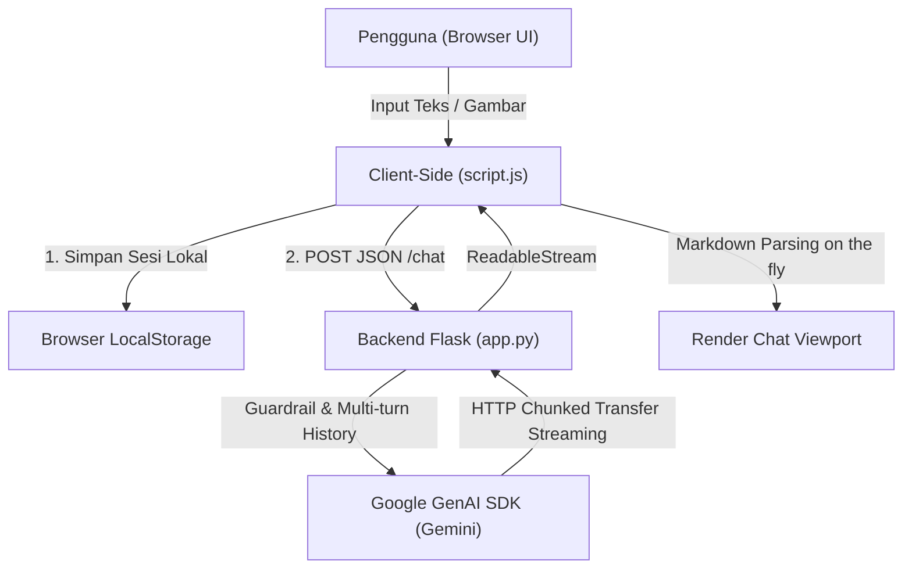

# Game Assistant AI (Gemini API)

Chatbox AI yang fokus sebagai **asisten khusus seputar video game**: strategi, walkthrough, rekomendasi build, rekomendasi game, lore cerita, tips optimasi FPS, dan meta game terkini. 

Dibuat menggunakan **Flask** + **Google GenAI SDK** (Gemini), respons streaming real-time, riwayat percakapan dinamis (multi-turn), tema **Dark Gaming Glassmorphism**, dan proteksi prompt guardrails khusus topik game.

---

## Metode & Arsitektur Sistem

Aplikasi ini dibangun menggunakan beberapa pendekatan rekayasa perangkat lunak dan arsitektur AI modern:



### 1. Large Language Model (LLM) & Multimodal Generation
- **Google GenAI SDK (`google-genai`)**: Menggunakan model keluarga Gemini (`gemini-3.5-flash-lite`, `gemini-flash-lite-latest`, `gemini-3.8-flash`) untuk inferensi teks berkecepatan tinggi dengan latensi rendah.
- **Multimodal Content Processing**: Input gambar (screenshot gameplay / spesifikasi perangkat) dikonversi menjadi format Base64 di sisi klien, kemudian diuraikan menjadi objek binary `types.Part.from_bytes` agar LLM dapat menganalisis gambar secara langsung.

### 2. Guardrails & System Prompt Engineering
- **Domain-Specific Guardrail**: AI diprogram dengan instruksi sistem ketat (`SYSTEM_PROMPT`) untuk hanya melayani topik seputar dunia game (PC, konsol, mobile, retro, indie, e-sports). Pertanyaan di luar ranah video game secara terprogram akan ditolak dengan ramah dan santai khas persona gamer.
- **Role Consistency**: Menjaga persona asisten tetap konsisten, to-the-point, dan komunikatif dalam bahasa Indonesia.

### 3. Server-Sent Streaming (Chunked Transfer Encoding)
- Menggunakan fitur `generate_content_stream` dari Gemini API yang dipadukan dengan Flask `stream_with_context(Response(..., mimetype='text/plain'))`.
- Karakter/token jawaban dikirim langsung ke browser tanpa menunggu respons penuh selesai di-generate. Di sisi klien, `ReadableStream` dan `TextDecoder` membaca potongan respons secara bertahap untuk memberikan feedback visual instan (*typing effect* natural).

### 4. Manajemen Konteks & Multi-Turn Memory
- **Dual-Layer Context Retention**:
  - **Sisi Klien (LocalStorage)**: Menyimpan multi-thread percakapan, metadata timestamp, dan daftar indeks pertanyaan untuk navigasi cepat (*smooth jump*).
  - **Sisi Server (Flask Session)**: Membatasi konteks percakapan terakhir (`MAX_HISTORY = 20`) untuk menjaga efisiensi token dan mencegah context window overflow.
- **Failover / Fallback Mechanism**: Jika model spesifik mengalami status `503 Overloaded`, sistem backend secara otomatis mengalihkan permintaan ke model cadangan default tanpa memutuskan sesi pengguna.

---

## Fitur Utama
- **100% Fokus Game**: AI otomatis menolak topik di luar game dengan gaya santai khas gamer.
- **Multi-turn Memory**: Mengingat konteks percakapan di dalam sesi aktif.
- **Sidebar Navigasi & Index Pertanyaan**: Navigasi riwayat sesi obrolan (kiri) dan daftar index pertanyaan untuk lompat langsung ke pesan tanpa reload/regenerate (kanan).
- **Streaming Response**: Respons dikirim secara real-time token per token.
- **Upload / Lampirkan File**: Mendukung analisis screenshot atau dokumen game.
- **Konfigurasi Aman**: Menggunakan file `.env` yang diabaikan oleh Git (`.gitignore`).

---

## Struktur Proyek

```
chatbox-ai/
├── app.py               # Backend Flask & integrasi Google GenAI SDK
├── requirements.txt     # Daftar dependency Python
├── .env.example         # Template konfigurasi environment variables
├── .env                 # File konfigurasi lokal (JANGAN di-commit ke Git)
├── .gitignore           # Daftar file/folder yang diabaikan Git
├── templates/
│   └── index.html       # Tampilan antarmuka chat
└── static/
    ├── style.css        # Desain antarmuka Dark Gaming Glassmorphism
    ├── script.js        # Logika client-side, streaming, & navigasi sesi
    ├── circuit_bg.png   # Wallpaper sirkuit neon
    └── logo_icon.png    # Ikon logo Game Assistant
```

---

## Cara Menjalankan

1. Install dependency:
   ```bash
   pip install -r requirements.txt
   ```

2. Buat dan Konfigurasi file `.env`:
   Isi file dengan 3 baris kode dibawah dan pastikan file `.env` sudah terisi API key kamu:
   ```env
   GEMINI_API_KEY=your_gemini_api_key_here
   GEMINI_MODEL=gemini-3.5-flash-lite
   FLASK_SECRET_KEY=secret-key-acak
   ```

3. Jalankan aplikasi:
   ```bash
   python app.py
   ```

4. Buka browser ke:
   `http://127.0.0.1:5000`

